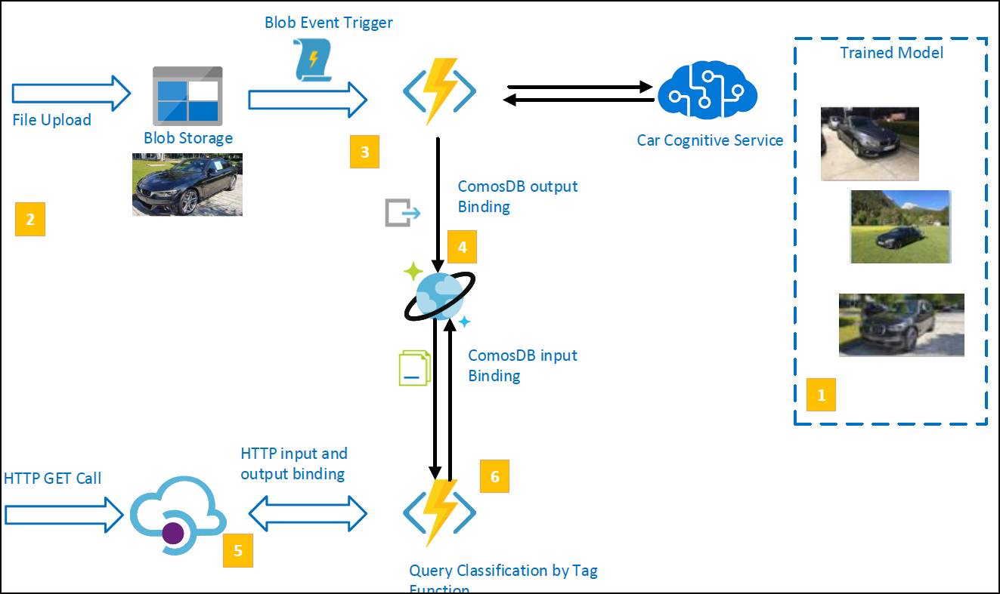

# Serverless Workshop 
This workshop builds an event driven serverless application architecture which enables users to upload images and automatically classify car images using machine learning uploaded by users. Users can then query types of classification detected. 

 

 In the workshop you will.
 1. Train a machine learning classification model and publish the service over Azure cognitive services (Azure Custom Vision service)  
 1. Users upload images to blob storage 
 1. An Azure serverless function is triggered once a new file for processing is detected in the blob storage
 1. The image is classfied against the trained model and results are saved in the database 
 1. Users query the results by cartype or "tag" over REST interfaces 
 1. HTTP based serverless function queries the classification in the database and return results 

## Modules
1. Create and train [classification serivce](/module0.md)
1. Create a [Cosmos DB](/module1.md)
1. Create and test ServerLess nodejs function with a [Blob File Trigger](/module2.md)
1. Update [Serverless Function](/module3.md) to save file data in Cosmos DB.
1. Update [Serverless Function](/module4.md) to call Car Classification service and save results in Database.
1. Create [Serverless Function](/module5.md) with HTTP input and output (Bindings)

  
